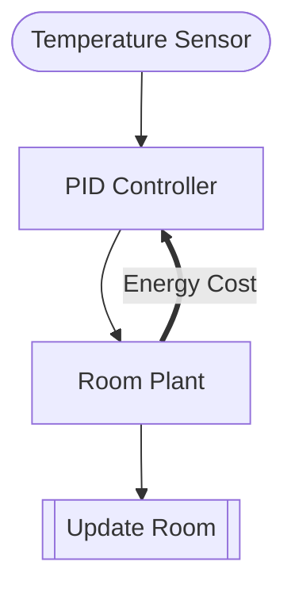

# Thermostat PID

**Adds feedback** -- backward information flow within a single evaluation.

## GDS Decomposition

```
X = (T, E)
U = measured_temp
g = pid_controller
f = update_room
Θ = {setpoint, Kp, Ki, Kd}
```

## Composition

```python
(sensor >> controller >> plant >> update).feedback([
    Energy Cost: plant -> controller CONTRAVARIANT
])
```



## What You'll Learn

- `.feedback()` composition for within-timestep backward flow
- **CONTRAVARIANT** flow direction (backward_out → backward_in)
- **ControlAction** role — reads state and emits control signals
- `backward_in` / `backward_out` ports on block interfaces
- Multi-variable Entity (Room has both temperature and energy_consumed)

!!! note "Key distinction"
    Room Plant is **ControlAction** (not Mechanism) because it has `backward_out`. Mechanisms cannot have backward ports.

## Files

- [model.py](https://github.com/DynamicalSystemsGroup/gds-core/blob/main/packages/gds-examples/control/thermostat/model.py)
- [test_model.py](https://github.com/DynamicalSystemsGroup/gds-core/blob/main/packages/gds-examples/control/thermostat/test_model.py)
- [VIEWS.md](https://github.com/DynamicalSystemsGroup/gds-core/blob/main/packages/gds-examples/control/thermostat/VIEWS.md)

## Experimental SysML v2 view

The [SysML export experiment](../sysml/README.md) projects this model into four
parts and three forward connections, with a companion mapping/loss manifest.
That artifact passed the pinned official Pilot validator with zero diagnostics.
The backward Energy Cost feedback is omitted with diagnostics; the view does
not reproduce the thermostat's execution behavior. See the
[interoperability guide](../../guides/sysml-v2.md) for tool integration status.
