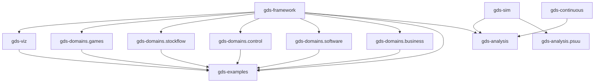

# GDS Ecosystem

The GDS ecosystem is a family of composable packages for specifying, visualizing, and analyzing complex systems.

## Packages

| Package | Import | Description |
|---|---|---|
| **gds-framework** | `gds` | Core engine — blocks, composition algebra, compiler, verification |
| **gds-viz** | `gds_viz` | Mermaid diagram renderers for GDS specifications |
| **gds-domains** | `gds_domains.stockflow` | Declarative stock-flow DSL over GDS semantics |
| | `gds_domains.control` | State-space control DSL over GDS semantics |
| | `gds_domains.games` | Typed DSL for compositional game theory (Open Games) |
| | `gds_domains.software` | Software architecture DSL (DFD, state machine, C4, ERD, etc.) |
| | `gds_domains.business` | Business dynamics DSL (CLD, supply chain, value stream map) |
| | `gds_domains.symbolic` | Symbolic equations and linearization; install `gds-domains[symbolic]` |
| **gds-interchange** | `gds_interchange.owl` | OWL/Turtle, SHACL, SPARQL, and RDF round-trip tooling |
| **gds-sim** | `gds_sim` | Simulation engine (standalone, Pydantic-only) |
| **gds-continuous** | `gds_continuous` | Continuous-time ODE simulation engine |
| **gds-analysis** | `gds_analysis` | GDSSpec-to-gds-sim bridge, reachability, trajectory metrics |
| **gds-analysis.psuu** | `gds_analysis.psuu` | Parameter sweeps, KPIs, optimization, sensitivity analysis |
| **gds-psuu** | `gds_psuu` | Deprecated compatibility package for `gds_analysis.psuu` |
| **gds-examples** | — | Tutorial models demonstrating framework features |

An experimental development exporter at `gds_interchange.sysml` projects flat
GDS architectures into SysML v2 text with a mapping/loss manifest. See
[SysML v2 interoperability](../guides/sysml-v2.md) for recorded Pilot validation,
unsupported semantics, and the untested OpenSysML and repository integrations.
Use the [package map](../packages/index.md) for current installation choices.

## Dependency Graph



## Architecture

```
gds-framework  ←  core engine (no GDS dependencies)
    ↑
gds-viz        ←  visualization (depends on gds-framework)
gds-domains.games      ←  game theory DSL (depends on gds-framework)
gds-domains.stockflow  ←  stock-flow DSL (depends on gds-framework)
gds-domains.control    ←  control systems DSL (depends on gds-framework)
gds-domains.software   ←  software architecture DSL (depends on gds-framework)
gds-domains.business   ←  business dynamics DSL (depends on gds-framework)
    ↑
gds-examples   ←  tutorials (depends on gds-framework + gds-viz + all DSLs)

gds-sim        ←  discrete-time simulation engine (standalone — no gds-framework dep, only pydantic)
gds-continuous ←  continuous-time ODE simulation engine
gds-analysis   ←  bridges GDSSpec structures to gds-sim runtime and reachability analysis
gds_analysis.psuu ← parameter sweeps, KPI scoring, optimization, sensitivity on gds-sim
```

## Links

- [GitHub Organization](https://github.com/DynamicalSystemsGroup)
- [GDS Theory Paper](https://doi.org/10.57938/e8d456ea-d975-4111-ac41-052ce73cb0cc) (Zargham & Shorish, 2022)
- [cadCAD Ecosystem](https://github.com/cadCAD-org/cadCAD)
- [DynamicalSystemsGroup](https://dynamicalsystemsgroup.com/)
