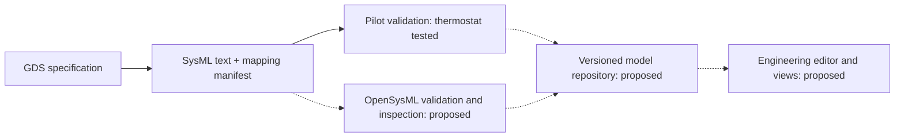

# SysML v2 interoperability

GDS can project a specification into a SysML v2 architecture view for inspection
by engineering tools. The experimental `gds_interchange.sysml` exporter produces
text and a mapping/loss manifest. The thermostat export has passed the official
Pilot validator; OpenSysML and repository-backed exchange remain untested.

The exporter remains unmerged development work. The downloadable artifacts
and validation evidence below are available for inspection, but generation
requires a development checkout containing the exporter. It is not part of the
published symbolic security releases.

## What is available

`spec_to_sysml` accepts a flat registry of atomic blocks and explicit wire
mappings. It exports parts, forward ports, scalar payload definitions, and
forward connections. Its result contains `text` and `manifest_json()`.

Keep the `.sysml` file and manifest together. The manifest records source URI,
source revision, mapping version, source-to-target entries, and diagnostics for
omitted semantics. Third-party tools do not automatically interpret this
GDS-specific manifest.

The [thermostat example](../examples/sysml/README.md) includes downloadable
artifacts and a generation command. Its four parts and three forward connections
were accepted by the official Pilot on 2026-09-25, with zero errors and zero
diagnostics. The [validation evidence](../examples/sysml/validation/README.md)
records the versions, hashes, logs, and negative controls.

## How the tools fit together

| Tool or repository | Role alongside GDS | Integration status |
|---|---|---|
| GDS / `gds-interchange` | Generate a structural view and preserve mapping provenance | Experimental exporter exists |
| Official SysML v2 Pilot | Parse, resolve references, and validate SysML against matching libraries | Thermostat accepted by a pinned version |
| OpenSysML | An additional language implementation with validation, model inspection, execution, and client APIs | Candidate consumer; GDS compatibility untested |
| Flexo / MMS | Store engineering models in repositories with projects, branches, and revisions | Proposed GDS exchange target |
| SysML v2 Web Modeler | Edit and render models through a SysML v2 API-backed service | Proposed consumer; GDS exchange untested |
| Eclipse SysON | An alternative SysML v2 modeling environment | Import/export capabilities must be checked for a chosen release |

[OpenSysML](https://github.com/Open-MBEE/opensysml) provides a Go implementation,
language server, REPL, runtime, and programmatic clients. Its execution support
creates overlap with GDS analysis, but equivalent results require explicit
behavioral mappings and tests. Acceptance by the Pilot does not establish
acceptance by OpenSysML.

[SysML v2 Web Modeler](https://github.com/Open-MBEE/sysmlv2-web-modeler) provides
text editing and model rendering against a repository API.
[Eclipse SysON](https://projects.eclipse.org/projects/modeling.syson) provides
web-based modeling. They are possible ways to inspect or edit an exchanged
architecture; neither has been tested with this GDS export.

A possible workflow is:

Dashed connections describe proposed integrations. The manifest must remain
associated with the source snapshot even when a repository stores the SysML
elements separately from the original text.

## Boundaries that matter

- **Behavior:** forward connectivity does not specify scheduling or state
  updates. Backward feedback and temporal wiring are omitted with diagnostics.
  GDS roles and execution contracts are not executable SysML behavior.
- **Types:** built-in scalar payloads are supported. Units, constraints, custom
  payload types, and IEEE floating-point semantics are not preserved by this
  projection.
- **Composition:** only flat atomic-block registries are accepted. Hierarchical
  composition and reusable definition/usage mappings need further design.
- **Identity:** generated identifiers are snapshot-local. They are not stable
  repository element identities, so edits cannot yet be reliably synchronized.
- **Direction:** there is no SysML importer, round-trip editing, API
  synchronization, or demonstrated simulation equivalence.

OpenSysML documents repository comparison and synchronization through its
[CLI](https://opensysml.org/reference/cli/). These operate on element identities;
transport support alone does not solve GDS identity or semantic mapping.
The [SysML v2 API reference implementation](https://github.com/Systems-Modeling/SysML-v2-API-Services)
is a separate integration boundary from the textual language.

## Next acceptance gates

1. Pin an OpenSysML version and its compatible libraries. Load the unchanged
   thermostat and both negative-control files; retain diagnostics and hashes.
2. Inspect the four parts and all three connection endpoint pairs. Compare them
   with the GDS manifest and the recorded Pilot result.
3. Test a repository import on a separate branch, preserving source text,
   manifest, source revision, and validation evidence. Check identity and
   revision behavior before attempting synchronization.
4. Define a selected reverse mapping only after structural exchange works.
   Executable analysis additionally requires explicit units, time contracts,
   supported functions, and behavior-equivalence tests.

The [comparison study](../research/sysml-v2-overlap.md) explains the underlying
mapping choices. Use the existing [OWL bridge](../owl/index.md) when RDF,
SHACL, or SPARQL is the required interface; RDF output by itself does not
establish SysML v2 API compatibility.
